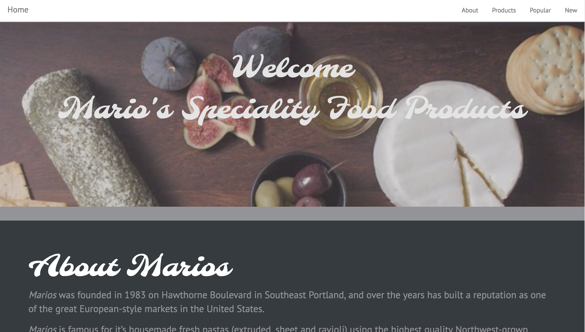
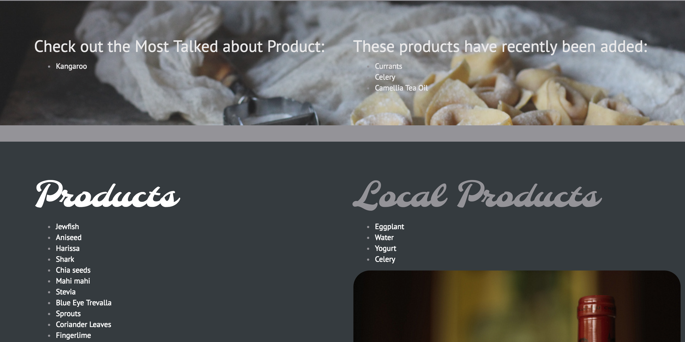
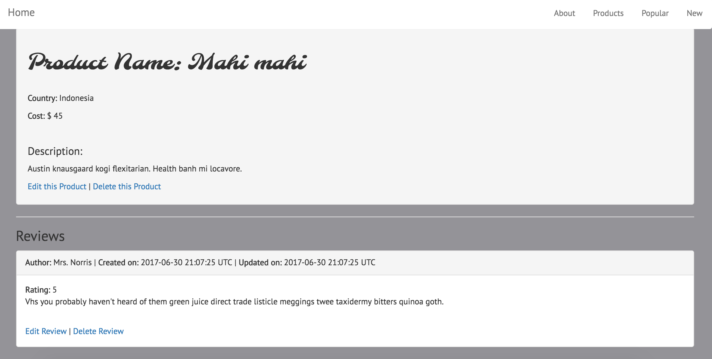

# Marios

#### _Nicky Santamaria_

## Description

An app to showcase products from Marios. Products and reviews of products can be added.

## Technologies used / Prerequisites

* [Ruby](https://www.ruby-lang.org/en/downloads/)
* [Rails](http://rubyonrails.org/)
* [PostgreSQL](https://www.postgresql.org/docs/9.2/static/app-psql.html)
* [Git](https://git-scm.com/)

## Installation

* `$ git clone https://github.com/nrsantamaria/marios`
* `$ cd marios`

## PostgreSQL Integration
* `$ postgres`
* `$ rake db:create`
* `$ rake db:migrate db:test:prepare`

## Seed database
* `$ rake db:reset`

## Development server

Run `rails s` for a dev server. Navigate to `http://localhost:3000/`. The app will automatically reload if you change any of the source files.

## Specifications

| Behavior |  Input   |  Output  |
|----------|:--------:|:--------:|
|User adds a product to database.|Name => 'Cheese', Cost => '50', Description => 'Fancy cheese.', Country => 'France'| Product Name: Cheese, Cost: $50, Description: Fancy Cheese, Country: France
|One-to-many database relationship. |User adds a review to a product.|Review is listed under a specific product.|
|User updates product|Product Name: Cheese, Edit Product Name => 'Stinky Cheese'|Product Name: Stinky Cheese|
|User deletes product|Product Name: Cheese, Delete Product|User is taken to product List|
|Product with the most reviews is displayed on the landing page.|Product Name: Stinky Cheese, Reviews: 10|Most Popular Product: Stinky Cheese|
|Most Recent products are displayed on the landing page.|Product: Cheese, Created At: Today, Product: Wine, Created At: Today, Product: Bread, Created At: Today, Product: Sardines, Created At: Yesterday|Product: Cheese, Created At: Today, Product: Wine, Created At: Today, Product: Bread, Created At: Today|
|Local products are displayed on the landing page.|Products: Cheese, France; Wine, USA; Sardines, Italy|Local Products: Wine, USA|
|Validates all fields are filled out.|Validate: name, cost, description, country|If description blank => Error: Must fill out description|
|Rating is between 1-5|Minimum rating 1, maximum rating 5|Rating 5|
|Review's content is between 50-250 characters|Content is in: 50..250|If content is under 50 characters => Error: you must include at least 50 characters.|

## Known Bugs
* N/A

## License

*This software is licensed under MIT license.*

```
Copyright (c) 2017 **Nicky Santamaria**
```




